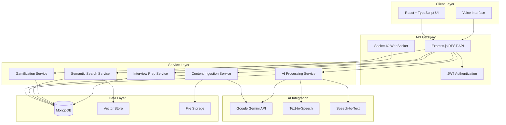
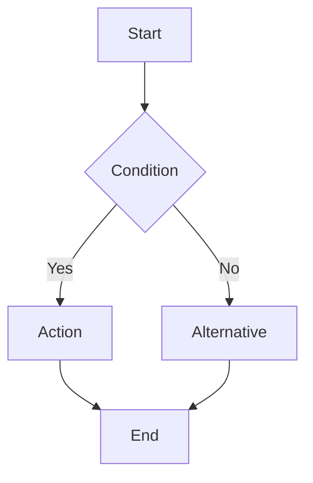

# Design Document: Kairon AI Learning Operating System

## Overview

Kairon AI is a comprehensive Learning Operating System that transforms passive educational content into an interactive, adaptive learning environment. The system architecture follows a modern three-tier pattern with a React-based frontend, Node.js/Express backend, and MongoDB database, integrated with Google Gemini AI for intelligent content processing and generation.

The platform serves multiple user personas:
- **Students**: Seeking efficient study tools with active recall and spaced repetition
- **Professionals**: Upskilling through structured learning paths
- **Developers**: Understanding codebases through automated documentation
- **Job Seekers**: Preparing for technical interviews with AI coaching

### Key Design Principles

1. **AI-First Architecture**: Every feature leverages generative AI to provide personalized, context-aware experiences
2. **Modular Design**: Clear separation between content ingestion, processing, storage, and presentation layers
3. **Real-Time Responsiveness**: Socket.IO integration for collaborative features and live updates
4. **Scalable Vector Search**: Efficient semantic search using embeddings and similarity algorithms
5. **Gamification Core**: Progress tracking, XP, and social features integrated throughout the user journey

## Architecture

### High-Level System Architecture



### Technology Stack Rationale

**Frontend (React + TypeScript + Vite)**
- React provides component reusability and efficient rendering for complex UI states
- TypeScript ensures type safety, reducing runtime errors in a feature-rich application
- Vite offers fast development builds and hot module replacement
- Tailwind CSS enables rapid, consistent styling with utility classes
- Framer Motion provides smooth animations for gamification feedback

**Backend (Node.js + Express)**
- Node.js enables JavaScript across the stack, simplifying development
- Express provides lightweight, flexible routing and middleware architecture
- Async/await patterns handle concurrent AI API calls efficiently
- Easy integration with Socket.IO for real-time features

**Database (MongoDB + Mongoose)**
- Document-oriented storage fits the varied structure of learning materials
- Flexible schema accommodates different content types without migrations
- Mongoose ODM provides schema validation and query building
- Efficient indexing for user queries and content retrieval

**AI Engine (Google Gemini)**
- Gemini Pro offers strong reasoning for tutoring and content generation
- Gemini Flash provides fast responses for real-time interactions
- Multimodal capabilities support text, image, and code analysis
- Cost-effective compared to alternatives for high-volume usage


## Components and Interfaces

### 1. Content Ingestion Service

**Responsibility**: Process and extract content from multiple file formats and sources.

**Key Components**:

```typescript
interface ContentIngestionService {
  uploadFile(file: File, userId: string): Promise<UploadResult>;
  extractPDF(fileId: string): Promise<ExtractedContent>;
  extractWord(fileId: string): Promise<ExtractedContent>;
  transcribeAudio(fileId: string): Promise<ExtractedContent>;
  fetchYouTubeTranscript(videoUrl: string): Promise<ExtractedContent>;
  digitizeImage(fileId: string): Promise<ExtractedContent>;
  generateCurriculum(topic: string): Promise<Curriculum>;
}

interface UploadResult {
  fileId: string;
  fileName: string;
  fileType: string;
  size: number;
  uploadedAt: Date;
}

interface ExtractedContent {
  fileId: string;
  rawText: string;
  metadata: ContentMetadata;
  chunks: TextChunk[];
}

interface TextChunk {
  id: string;
  text: string;
  startIndex: number;
  endIndex: number;
  embedding?: number[];
}

interface Curriculum {
  topic: string;
  modules: Module[];
  estimatedHours: number;
}

interface Module {
  title: string;
  subtopics: string[];
  learningObjectives: string[];
  sequence: number;
}
```

**Processing Pipeline**:
1. File upload → Multer middleware validates and stores file
2. File type detection → Route to appropriate extractor
3. Content extraction → Use libraries (pdf-parse, mammoth, etc.) or AI vision
4. Text chunking → Split into manageable segments (500-1000 tokens)
5. Embedding generation → Call Gemini API to generate vector embeddings
6. Storage → Save to MongoDB with references to file storage

**Error Handling**:
- Unsupported file types return 400 with supported formats list
- Extraction failures retry once, then return partial content with warning
- Large files (>50MB) are rejected with size limit message

### 2. AI Processing Service

**Responsibility**: Interface with Google Gemini API for all AI-powered features.

**Key Components**:

```typescript
interface AIProcessingService {
  generateFlashcards(content: string, count: number): Promise<Flashcard[]>;
  generateQuiz(content: string, questionCount: number): Promise<Quiz>;
  chatWithTutor(message: string, context: string[], history: ChatMessage[]): Promise<TutorResponse>;
  analyzeCode(code: string, language: string): Promise<CodeAnalysis>;
  translateCode(code: string, fromLang: string, toLang: string): Promise<string>;
  generateConceptMap(content: string): Promise<ConceptGraph>;
  evaluateSolution(question: string, solution: string): Promise<Evaluation>;
  conductMockInterview(type: InterviewType, transcript: string[]): Promise<InterviewResponse>;
  optimizeResume(resumeText: string, jobDescription: string): Promise<ResumeAnalysis>;
  generateAudioScript(content: string): Promise<string>;
}

interface Flashcard {
  id: string;
  question: string;
  answer: string;
  difficulty: 'easy' | 'medium' | 'hard';
  tags: string[];
}

interface Quiz {
  id: string;
  questions: MCQQuestion[];
  totalPoints: number;
}

interface MCQQuestion {
  id: string;
  question: string;
  options: string[];
  correctIndex: number;
  explanation: string;
  points: number;
}

interface TutorResponse {
  message: string;
  isSocraticQuestion: boolean;
  suggestedFollowUps: string[];
  relevantConcepts: string[];
}

interface CodeAnalysis {
  explanation: string;
  timeComplexity: string;
  spaceComplexity: string;
  optimizationSuggestions: string[];
  flowchart: string; // Mermaid.js syntax
}

interface ConceptGraph {
  nodes: ConceptNode[];
  edges: ConceptEdge[];
}

interface ConceptNode {
  id: string;
  label: string;
  description: string;
  importance: number; // 0-1 for sizing
}

interface ConceptEdge {
  source: string;
  target: string;
  relationship: string;
  strength: number; // 0-1 for edge thickness
}
```

**Prompt Engineering Strategy**:
- **Flashcard Generation**: "Extract key concepts and create question-answer pairs. Questions should test understanding, not memorization. Format: Q: [question] A: [answer]"
- **Socratic Tutoring**: "You are a Socratic tutor. Guide the student with questions rather than direct answers. Use the provided context: [context]. Student question: [question]"
- **Code Analysis**: "Analyze this code: [code]. Provide: 1) Plain English explanation, 2) Time complexity with justification, 3) Space complexity with justification, 4) Optimization suggestions"

**Rate Limiting & Caching**:
- Implement exponential backoff for API failures
- Cache common queries (e.g., curriculum for popular topics) in Redis
- Queue non-urgent requests (flashcard generation) to smooth API usage

### 3. Semantic Search Service

**Responsibility**: Enable vector-based semantic search across user's learning materials.

**Key Components**:

```typescript
interface SemanticSearchService {
  indexContent(content: ExtractedContent): Promise<void>;
  search(query: string, userId: string, limit: number): Promise<SearchResult[]>;
  findSimilar(contentId: string, limit: number): Promise<SearchResult[]>;
  deleteIndex(contentId: string): Promise<void>;
}

interface SearchResult {
  contentId: string;
  chunkId: string;
  text: string;
  score: number; // Cosine similarity 0-1
  metadata: ContentMetadata;
  highlights: string[];
}

interface ContentMetadata {
  title: string;
  source: string;
  uploadDate: Date;
  fileType: string;
  tags: string[];
}
```

**Vector Search Implementation**:
1. **Embedding Generation**: Use Gemini API `embedding-001` model to generate 768-dimensional vectors
2. **Storage**: Store embeddings in MongoDB with 2dsphere index or dedicated vector DB (Pinecone/Weaviate for scale)
3. **Similarity Calculation**: Cosine similarity between query embedding and stored embeddings
4. **Ranking**: Sort by similarity score, filter by user ownership
5. **Highlighting**: Extract surrounding context (±50 tokens) from matched chunks

**Optimization**:
- Pre-compute embeddings during content ingestion (async job)
- Use approximate nearest neighbor (ANN) algorithms for large datasets
- Implement pagination for search results

### 4. Gamification Service

**Responsibility**: Track user progress, calculate XP, manage achievements and leaderboards.

**Key Components**:

```typescript
interface GamificationService {
  awardXP(userId: string, activity: ActivityType, metadata: any): Promise<XPResult>;
  updateStreak(userId: string): Promise<StreakResult>;
  checkAchievements(userId: string): Promise<Achievement[]>;
  getLeaderboard(timeframe: Timeframe, limit: number): Promise<LeaderboardEntry[]>;
  createStudyWar(creatorId: string, participants: string[], duration: number): Promise<StudyWar>;
  updateStudyWar(warId: string, userId: string, progress: WarProgress): Promise<void>;
  endStudyWar(warId: string): Promise<WarResult>;
}

interface XPResult {
  xpAwarded: number;
  totalXP: number;
  previousLevel: number;
  currentLevel: number;
  leveledUp: boolean;
}

interface StreakResult {
  currentStreak: number;
  longestStreak: number;
  streakBroken: boolean;
}

interface Achievement {
  id: string;
  title: string;
  description: string;
  icon: string;
  unlockedAt: Date;
  rarity: 'common' | 'rare' | 'epic' | 'legendary';
}

interface LeaderboardEntry {
  rank: number;
  userId: string;
  username: string;
  xp: number;
  level: number;
  avatar: string;
}

interface StudyWar {
  id: string;
  participants: WarParticipant[];
  startTime: Date;
  endTime: Date;
  status: 'active' | 'completed';
}

interface WarParticipant {
  userId: string;
  username: string;
  studyTime: number; // minutes
  xpEarned: number;
  cardsReviewed: number;
}
```

**XP Calculation Formula**:
```
Base XP by Activity:
- Flashcard review: 5 XP
- Quiz completion: 10 XP × (score percentage)
- Study session (per 25 min): 20 XP
- Mock interview: 50 XP
- Code analysis: 15 XP

Multipliers:
- Streak bonus: 1 + (streak_days × 0.1) up to 2x
- Difficulty bonus: Easy 1x, Medium 1.5x, Hard 2x
- Perfect score bonus: +25% XP

Level Calculation:
Level = floor(sqrt(totalXP / 100))
XP for next level = (currentLevel + 1)² × 100
```

**Achievement System**:
- Define achievements in configuration (JSON)
- Check triggers after each XP award
- Unlock achievements atomically to prevent duplicates
- Broadcast achievement unlocks via Socket.IO for real-time celebration

### 5. Interview Preparation Service

**Responsibility**: Manage interview questions, mock interviews, and resume analysis.

**Key Components**:

```typescript
interface InterviewPrepService {
  getQuestions(category: QuestionCategory, difficulty: Difficulty): Promise<InterviewQuestion[]>;
  submitSolution(questionId: string, solution: string, userId: string): Promise<SolutionFeedback>;
  startMockInterview(type: InterviewType, userId: string): Promise<MockInterviewSession>;
  processMockResponse(sessionId: string, audioBlob: Blob): Promise<InterviewFeedback>;
  endMockInterview(sessionId: string): Promise<InterviewReport>;
  analyzeResume(resumeFile: File, jobDescription: string): Promise<ResumeAnalysis>;
}

interface InterviewQuestion {
  id: string;
  category: QuestionCategory;
  difficulty: Difficulty;
  title: string;
  description: string;
  hints: string[];
  sampleSolution?: string;
  companies: string[]; // Companies known to ask this
}

type QuestionCategory = 'dsa' | 'system-design' | 'behavioral' | 'frontend' | 'backend';
type Difficulty = 'easy' | 'medium' | 'hard';

interface SolutionFeedback {
  correct: boolean;
  score: number; // 0-100
  feedback: string;
  improvements: string[];
  timeComplexity: string;
  spaceComplexity: string;
}

interface MockInterviewSession {
  sessionId: string;
  type: InterviewType;
  questions: string[];
  currentQuestionIndex: number;
  startTime: Date;
}

type InterviewType = 'technical' | 'behavioral' | 'system-design';

interface InterviewFeedback {
  transcription: string;
  evaluation: string;
  strengths: string[];
  improvements: string[];
  nextQuestion: string;
}

interface InterviewReport {
  sessionId: string;
  duration: number;
  questionsAsked: number;
  overallScore: number;
  technicalAccuracy: number;
  communicationScore: number;
  detailedFeedback: string;
  recording: string; // URL to audio recording
}

interface ResumeAnalysis {
  atsScore: number; // 0-100
  matchScore: number; // 0-100 vs job description
  missingKeywords: string[];
  formattingIssues: string[];
  recommendations: string[];
  strengthsIdentified: string[];
}
```

**Mock Interview Flow**:
1. User selects interview type → System generates question sequence
2. System asks question via text-to-speech
3. User responds via voice → Speech-to-text transcription
4. AI evaluates response → Provides feedback
5. System asks follow-up or next question
6. After 5-7 questions → Generate comprehensive report

**Resume Parsing Strategy**:
- Use pdf-parse or similar library to extract text
- Identify sections (Education, Experience, Skills) via regex patterns
- Extract keywords and compare against job description
- Check ATS compatibility (font usage, section headers, formatting)
- Generate match score based on keyword overlap and experience relevance


### 6. Spaced Repetition System (SRS)

**Responsibility**: Calculate optimal review intervals for flashcards based on user performance.

**Key Components**:

```typescript
interface SRSService {
  scheduleCard(cardId: string, userId: string): Promise<ReviewSchedule>;
  recordReview(cardId: string, userId: string, rating: Rating): Promise<ReviewSchedule>;
  getDueCards(userId: string): Promise<FlashcardWithSchedule[]>;
  getUpcomingReviews(userId: string, days: number): Promise<ReviewCalendar>;
}

interface ReviewSchedule {
  cardId: string;
  nextReviewDate: Date;
  interval: number; // days
  easeFactor: number;
  repetitions: number;
}

type Rating = 'again' | 'hard' | 'good' | 'easy';

interface FlashcardWithSchedule {
  flashcard: Flashcard;
  schedule: ReviewSchedule;
  daysOverdue: number;
}

interface ReviewCalendar {
  date: Date;
  dueCount: number;
  newCount: number;
}
```

**SM-2 Algorithm Implementation**:
```
Initial values:
- interval = 1 day
- easeFactor = 2.5
- repetitions = 0

On review:
1. If rating = 'again':
   - repetitions = 0
   - interval = 1
   
2. If rating = 'hard':
   - easeFactor = max(1.3, easeFactor - 0.15)
   - interval = interval × 1.2
   
3. If rating = 'good':
   - repetitions += 1
   - if repetitions = 1: interval = 1
   - if repetitions = 2: interval = 6
   - if repetitions > 2: interval = interval × easeFactor
   
4. If rating = 'easy':
   - easeFactor = min(2.5, easeFactor + 0.15)
   - repetitions += 1
   - interval = interval × easeFactor × 1.3

nextReviewDate = today + interval
```

**Optimization**:
- Index cards by (userId, nextReviewDate) for efficient due card queries
- Pre-calculate review counts for upcoming days (cache in Redis)
- Batch update schedules to reduce database writes

### 7. Voice Interaction Service

**Responsibility**: Handle speech-to-text and text-to-speech for voice-based features.

**Key Components**:

```typescript
interface VoiceService {
  transcribeAudio(audioBlob: Blob): Promise<Transcription>;
  synthesizeSpeech(text: string, voice: VoiceOptions): Promise<AudioBuffer>;
  startVoiceSession(userId: string): Promise<VoiceSession>;
  processVoiceQuery(sessionId: string, audioBlob: Blob): Promise<VoiceResponse>;
}

interface Transcription {
  text: string;
  confidence: number;
  language: string;
  duration: number;
}

interface VoiceOptions {
  language: string;
  speed: number; // 0.5 - 2.0
  pitch: number; // 0.5 - 2.0
  voice: 'male' | 'female' | 'neutral';
}

interface VoiceSession {
  sessionId: string;
  userId: string;
  context: string[];
  startTime: Date;
}

interface VoiceResponse {
  transcription: string;
  textResponse: string;
  audioResponse: AudioBuffer;
  confidence: number;
}
```

**Implementation Options**:
- **Browser-based**: Web Speech API for client-side processing (free, privacy-friendly)
- **Cloud-based**: Google Cloud Speech-to-Text / Text-to-Speech (higher quality, cost)
- **Hybrid**: Use browser API with cloud fallback for unsupported browsers

**Audio Processing Pipeline**:
1. Client captures audio via MediaRecorder API
2. Send audio blob to backend (or process client-side)
3. Transcribe to text
4. Process query through AI service
5. Generate text response
6. Synthesize speech from response
7. Stream audio back to client

### 8. Study Planning Service

**Responsibility**: Generate personalized study schedules based on goals and deadlines.

**Key Components**:

```typescript
interface StudyPlanningService {
  createPlan(userId: string, goals: LearningGoal[]): Promise<StudyPlan>;
  updatePlan(planId: string, adjustments: PlanAdjustment): Promise<StudyPlan>;
  getUpcomingSessions(userId: string, days: number): Promise<StudySession[]>;
  recordSession(sessionId: string, completion: SessionCompletion): Promise<void>;
  adjustForDeadline(planId: string, deadline: Date): Promise<StudyPlan>;
}

interface LearningGoal {
  topic: string;
  targetDate: Date;
  currentLevel: 'beginner' | 'intermediate' | 'advanced';
  targetLevel: 'intermediate' | 'advanced' | 'expert';
  weeklyHours: number;
}

interface StudyPlan {
  id: string;
  userId: string;
  goals: LearningGoal[];
  sessions: StudySession[];
  createdAt: Date;
  lastUpdated: Date;
}

interface StudySession {
  id: string;
  date: Date;
  duration: number; // minutes
  topic: string;
  activities: ActivityPlan[];
  completed: boolean;
}

interface ActivityPlan {
  type: 'read' | 'flashcards' | 'quiz' | 'practice' | 'review';
  content: string;
  estimatedMinutes: number;
}

interface SessionCompletion {
  actualDuration: number;
  activitiesCompleted: string[];
  difficulty: 'too-easy' | 'appropriate' | 'too-hard';
  notes: string;
}
```

**Scheduling Algorithm**:
```
1. Calculate total learning hours needed:
   hoursNeeded = estimateHours(currentLevel, targetLevel, topic)
   
2. Calculate available study time:
   daysAvailable = targetDate - today
   sessionsAvailable = daysAvailable × (weeklyHours / 7)
   
3. Distribute topics across sessions:
   - Prioritize topics with earlier deadlines
   - Interleave topics to prevent burnout
   - Schedule reviews using spaced repetition principles
   
4. Allocate activities per session:
   - 40% new content
   - 30% practice/application
   - 30% review/flashcards
   
5. Adjust for user feedback:
   - If "too-hard": reduce pace, add more review
   - If "too-easy": increase pace, add advanced content
```

### 9. Repository Analysis Service

**Responsibility**: Analyze GitHub repositories and generate documentation.

**Key Components**:

```typescript
interface RepoAnalysisService {
  analyzeRepository(repoUrl: string, userId: string): Promise<RepoAnalysis>;
  generateDocumentation(repoId: string): Promise<Documentation>;
  generateFlowcharts(repoId: string): Promise<Flowchart[]>;
  explainFile(repoId: string, filePath: string): Promise<FileExplanation>;
}

interface RepoAnalysis {
  id: string;
  repoUrl: string;
  name: string;
  language: string;
  framework: string;
  structure: FileTree;
  entryPoints: string[];
  dependencies: Dependency[];
  analyzedAt: Date;
}

interface FileTree {
  name: string;
  type: 'file' | 'directory';
  path: string;
  children?: FileTree[];
  linesOfCode?: number;
}

interface Dependency {
  name: string;
  version: string;
  type: 'production' | 'development';
}

interface Documentation {
  overview: string;
  architecture: string;
  components: ComponentDoc[];
  setupInstructions: string;
  apiReference: APIDoc[];
}

interface ComponentDoc {
  name: string;
  purpose: string;
  dependencies: string[];
  exports: string[];
}

interface Flowchart {
  title: string;
  mermaidSyntax: string;
  description: string;
}

interface FileExplanation {
  filePath: string;
  purpose: string;
  keyFunctions: FunctionDoc[];
  complexity: 'low' | 'medium' | 'high';
  suggestions: string[];
}

interface FunctionDoc {
  name: string;
  purpose: string;
  parameters: Parameter[];
  returns: string;
  complexity: string;
}
```

**Analysis Pipeline**:
1. **Clone/Fetch**: Use GitHub API to fetch repository contents
2. **Language Detection**: Analyze file extensions and package files
3. **Structure Mapping**: Build file tree with LOC counts
4. **Entry Point Identification**: Find main files (main.py, index.js, etc.)
5. **Dependency Extraction**: Parse package.json, requirements.txt, etc.
6. **AI Documentation**: Send code samples to Gemini for explanation
7. **Flowchart Generation**: Analyze control flow and generate Mermaid diagrams

**Mermaid.js Flowchart Generation**:
```
Prompt: "Analyze this code and generate a Mermaid.js flowchart showing the control flow. Use this format:

Code: [code_snippet]"
```


## Data Models

### User Model

```typescript
interface User {
  _id: ObjectId;
  email: string;
  passwordHash?: string; // Optional for OAuth users
  username: string;
  avatar: string;
  authProvider: 'local' | 'google' | 'github';
  oauthId?: string;
  
  // Gamification
  xp: number;
  level: number;
  streak: number;
  longestStreak: number;
  lastActivityDate: Date;
  achievements: string[]; // Achievement IDs
  
  // Preferences
  preferences: {
    dailyGoal: number; // minutes
    notifications: boolean;
    publicProfile: boolean;
    theme: 'light' | 'dark' | 'auto';
    language: string;
  };
  
  // Quotas
  storageUsed: number; // bytes
  storageLimit: number; // bytes
  
  createdAt: Date;
  updatedAt: Date;
}
```

### Learning Material Model

```typescript
interface LearningMaterial {
  _id: ObjectId;
  userId: ObjectId;
  title: string;
  type: 'pdf' | 'word' | 'audio' | 'video' | 'image' | 'code' | 'generated';
  source: string; // File path, URL, or "AI Generated"
  
  // Content
  rawText: string;
  chunks: TextChunk[];
  
  // Metadata
  metadata: {
    fileSize?: number;
    duration?: number; // For audio/video
    pageCount?: number; // For documents
    language?: string;
    author?: string;
    uploadDate: Date;
  };
  
  // Organization
  tags: string[];
  folder?: string;
  
  // Processing status
  status: 'uploading' | 'processing' | 'ready' | 'failed';
  processingError?: string;
  
  createdAt: Date;
  updatedAt: Date;
}

interface TextChunk {
  id: string;
  text: string;
  startIndex: number;
  endIndex: number;
  embedding: number[]; // 768-dimensional vector
  metadata: {
    page?: number;
    timestamp?: number; // For audio/video
    heading?: string;
  };
}
```

### Flashcard Model

```typescript
interface Flashcard {
  _id: ObjectId;
  userId: ObjectId;
  materialId: ObjectId;
  
  // Content
  question: string;
  answer: string;
  hint?: string;
  
  // Classification
  difficulty: 'easy' | 'medium' | 'hard';
  tags: string[];
  
  // SRS Data
  schedule: {
    nextReviewDate: Date;
    interval: number; // days
    easeFactor: number;
    repetitions: number;
    lastReviewed?: Date;
  };
  
  // Statistics
  stats: {
    totalReviews: number;
    correctReviews: number;
    averageRating: number;
  };
  
  createdAt: Date;
  updatedAt: Date;
}
```

### Quiz Model

```typescript
interface Quiz {
  _id: ObjectId;
  userId: ObjectId;
  materialId: ObjectId;
  
  title: string;
  questions: QuizQuestion[];
  
  // Configuration
  timeLimit?: number; // minutes
  passingScore: number; // percentage
  
  createdAt: Date;
}

interface QuizQuestion {
  id: string;
  question: string;
  options: string[];
  correctIndex: number;
  explanation: string;
  points: number;
  tags: string[];
}

interface QuizAttempt {
  _id: ObjectId;
  quizId: ObjectId;
  userId: ObjectId;
  
  answers: QuizAnswer[];
  score: number;
  percentage: number;
  passed: boolean;
  
  timeSpent: number; // seconds
  completedAt: Date;
}

interface QuizAnswer {
  questionId: string;
  selectedIndex: number;
  correct: boolean;
  timeSpent: number; // seconds
}
```

### Chat Conversation Model

```typescript
interface Conversation {
  _id: ObjectId;
  userId: ObjectId;
  materialIds: ObjectId[]; // Materials used as context
  
  title: string; // Auto-generated from first message
  messages: ChatMessage[];
  
  createdAt: Date;
  updatedAt: Date;
}

interface ChatMessage {
  id: string;
  role: 'user' | 'assistant';
  content: string;
  timestamp: Date;
  
  // Context used for this message
  contextChunks?: string[];
  
  // Feedback
  helpful?: boolean;
  feedback?: string;
}
```

### Study Plan Model

```typescript
interface StudyPlan {
  _id: ObjectId;
  userId: ObjectId;
  
  title: string;
  goals: LearningGoal[];
  
  sessions: StudySession[];
  
  status: 'active' | 'completed' | 'paused';
  
  createdAt: Date;
  updatedAt: Date;
}

interface LearningGoal {
  id: string;
  topic: string;
  materialIds: ObjectId[];
  targetDate: Date;
  currentLevel: string;
  targetLevel: string;
  weeklyHours: number;
  progress: number; // 0-100
}

interface StudySession {
  id: string;
  date: Date;
  duration: number; // minutes
  topic: string;
  activities: ActivityPlan[];
  
  // Completion tracking
  completed: boolean;
  actualDuration?: number;
  completedActivities?: string[];
  feedback?: SessionFeedback;
}

interface SessionFeedback {
  difficulty: 'too-easy' | 'appropriate' | 'too-hard';
  engagement: number; // 1-5
  notes: string;
}
```

### Interview Question Model

```typescript
interface InterviewQuestion {
  _id: ObjectId;
  
  category: 'dsa' | 'system-design' | 'behavioral' | 'frontend' | 'backend';
  difficulty: 'easy' | 'medium' | 'hard';
  
  title: string;
  description: string;
  hints: string[];
  
  // For coding questions
  sampleInput?: string;
  sampleOutput?: string;
  constraints?: string[];
  
  // For system design
  requirements?: string[];
  scalingFactors?: string[];
  
  // Metadata
  companies: string[];
  frequency: number; // How often asked
  tags: string[];
  
  // Solutions (hidden until attempted)
  sampleSolution?: string;
  optimalComplexity?: {
    time: string;
    space: string;
  };
  
  createdAt: Date;
}

interface QuestionAttempt {
  _id: ObjectId;
  questionId: ObjectId;
  userId: ObjectId;
  
  solution: string;
  language?: string;
  
  // Evaluation
  feedback: string;
  score: number; // 0-100
  correct: boolean;
  
  timeSpent: number; // seconds
  attemptedAt: Date;
}
```

### Mock Interview Model

```typescript
interface MockInterview {
  _id: ObjectId;
  userId: ObjectId;
  
  type: 'technical' | 'behavioral' | 'system-design';
  
  questions: InterviewQuestion[];
  responses: InterviewResponse[];
  
  // Recording
  audioUrl?: string;
  transcript: string;
  
  // Evaluation
  overallScore: number;
  technicalAccuracy: number;
  communicationScore: number;
  detailedFeedback: string;
  
  duration: number; // seconds
  completedAt: Date;
}

interface InterviewResponse {
  questionId: string;
  question: string;
  userResponse: string;
  evaluation: string;
  score: number;
  strengths: string[];
  improvements: string[];
}
```

### Study War Model

```typescript
interface StudyWar {
  _id: ObjectId;
  creatorId: ObjectId;
  
  title: string;
  participants: WarParticipant[];
  
  startTime: Date;
  endTime: Date;
  duration: number; // minutes
  
  status: 'pending' | 'active' | 'completed';
  
  // Winner
  winnerId?: ObjectId;
  
  createdAt: Date;
}

interface WarParticipant {
  userId: ObjectId;
  username: string;
  avatar: string;
  
  // Metrics
  studyTime: number; // minutes
  xpEarned: number;
  cardsReviewed: number;
  quizzesCompleted: number;
  
  // Real-time updates
  lastActivity: Date;
  online: boolean;
}
```

### Achievement Model

```typescript
interface Achievement {
  _id: string; // Predefined IDs
  
  title: string;
  description: string;
  icon: string;
  rarity: 'common' | 'rare' | 'epic' | 'legendary';
  
  // Unlock criteria
  criteria: {
    type: 'xp' | 'streak' | 'cards' | 'quizzes' | 'study-time' | 'perfect-score';
    threshold: number;
  };
  
  // Rewards
  xpBonus: number;
}

// Predefined achievements stored in configuration
const ACHIEVEMENTS: Achievement[] = [
  {
    _id: 'first-steps',
    title: 'First Steps',
    description: 'Complete your first study session',
    icon: '🎯',
    rarity: 'common',
    criteria: { type: 'study-time', threshold: 1 },
    xpBonus: 50
  },
  {
    _id: 'week-warrior',
    title: 'Week Warrior',
    description: 'Maintain a 7-day streak',
    icon: '🔥',
    rarity: 'rare',
    criteria: { type: 'streak', threshold: 7 },
    xpBonus: 200
  },
  // ... more achievements
];
```

### Repository Analysis Model

```typescript
interface RepositoryAnalysis {
  _id: ObjectId;
  userId: ObjectId;
  
  repoUrl: string;
  repoName: string;
  
  // Analysis results
  language: string;
  framework: string;
  structure: FileTree;
  entryPoints: string[];
  dependencies: Dependency[];
  
  // Generated content
  documentation: string;
  flowcharts: Flowchart[];
  
  // File explanations (cached)
  fileExplanations: Map<string, FileExplanation>;
  
  analyzedAt: Date;
  createdAt: Date;
}
```

### Database Indexes

**Critical indexes for performance**:

```javascript
// Users
db.users.createIndex({ email: 1 }, { unique: true });
db.users.createIndex({ username: 1 }, { unique: true });
db.users.createIndex({ oauthId: 1, authProvider: 1 });

// Learning Materials
db.learningMaterials.createIndex({ userId: 1, createdAt: -1 });
db.learningMaterials.createIndex({ userId: 1, tags: 1 });
db.learningMaterials.createIndex({ "chunks.embedding": "2dsphere" }); // For vector search

// Flashcards
db.flashcards.createIndex({ userId: 1, "schedule.nextReviewDate": 1 });
db.flashcards.createIndex({ userId: 1, materialId: 1 });
db.flashcards.createIndex({ userId: 1, tags: 1 });

// Quizzes
db.quizzes.createIndex({ userId: 1, materialId: 1 });
db.quizAttempts.createIndex({ userId: 1, completedAt: -1 });

// Conversations
db.conversations.createIndex({ userId: 1, updatedAt: -1 });

// Study Plans
db.studyPlans.createIndex({ userId: 1, status: 1 });

// Interview Questions
db.interviewQuestions.createIndex({ category: 1, difficulty: 1 });
db.questionAttempts.createIndex({ userId: 1, questionId: 1 });

// Study Wars
db.studyWars.createIndex({ status: 1, endTime: 1 });
db.studyWars.createIndex({ "participants.userId": 1, status: 1 });

// Repository Analysis
db.repositoryAnalyses.createIndex({ userId: 1, repoUrl: 1 });
```


## Correctness Properties

*A property is a characteristic or behavior that should hold true across all valid executions of a system—essentially, a formal statement about what the system should do. Properties serve as the bridge between human-readable specifications and machine-verifiable correctness guarantees.*

### Property Reflection

After analyzing all acceptance criteria, several patterns emerged that allow us to consolidate redundant properties:

**Content Extraction Pattern**: Requirements 1.1, 1.2, 1.3, 1.4, 1.5 all follow the same pattern (upload → extract → store). These can be consolidated into a single prope